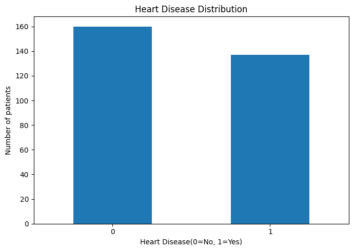
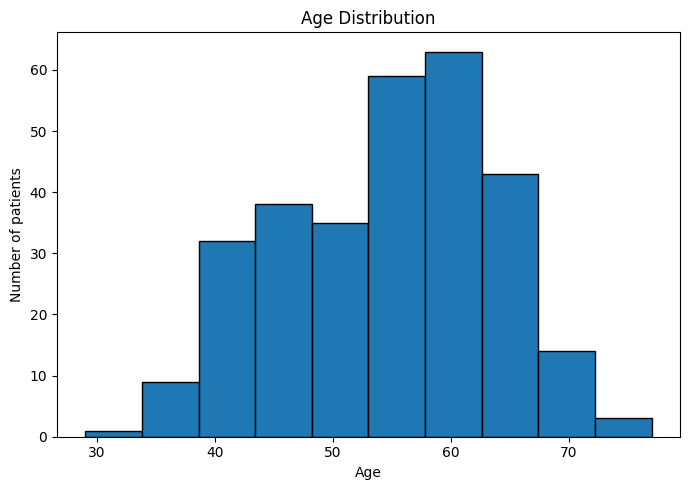
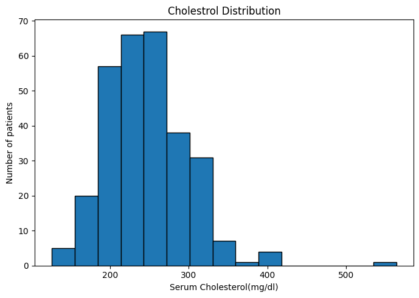

# python-heart-disease-analysis
Healthcare analytics project using Python, Pandas, Matplotlib, and Scikit-learn to analyze heart disease data and build predictive models.

# Heart Disease Risk Analysis and Prediction Using Python

## Project Overview

This project analyzes the UCI Heart Disease dataset using Python. The workflow includes data cleaning, exploratory data analysis, visualization, and machine learning.

The project is intended for educational and portfolio purposes only and is not a medical diagnostic tool.

## Exploratory Data Analysis

### Heart Disease Distribution



### Age Distribution



### Cholesterol Distribution



## Initial Findings

- The dataset contains 303 patient records.
- Heart disease cases are fairly balanced.
- Most patients are between 50 and 65 years old.
- Most cholesterol values fall between 200 and 300 mg/dL.
## Repository Structure

```text
data/
notebooks/
src/
images/
models/
README.md
requirements.txt

``` 
##Technologies
- Python
- Pandas
- Numpy
- Matplotlib
- Scikit-learn
- Jupyter Notebook

## Dataset
UCI Heart Disease dataset (Cleveland)

## Status
Active -Future Improvements Planned  
